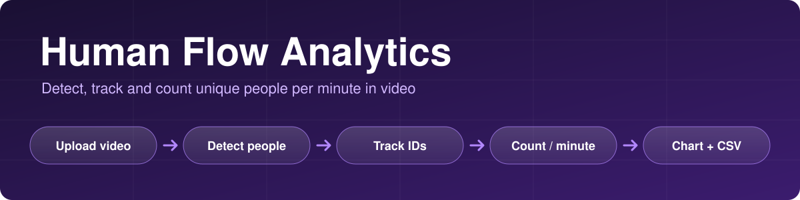
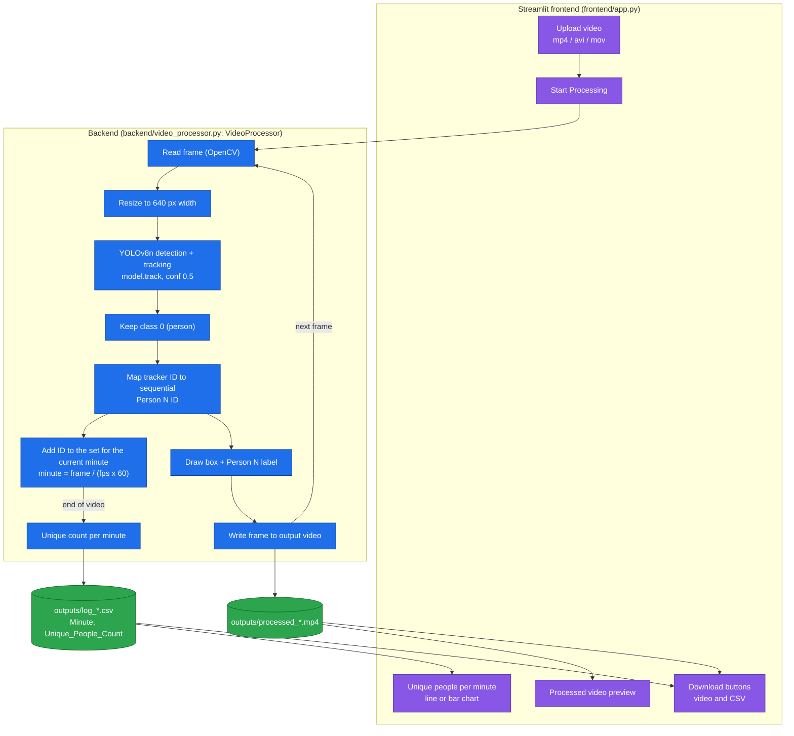

<p align="center">
  
</p>

<p align="center">
  
  
  
  
  
</p>

# Human Flow Analytics

**A video analytics app that detects and tracks people with YOLOv8, counts the unique individuals seen in each minute of a video, and presents the result as a chart, an annotated video and a CSV file, all in a Streamlit interface.**

Upload a video, start processing, and get back the same video with a numbered box around every tracked person, plus a per-minute count of unique people.

---

## Key features

- **Video upload** in `mp4`, `avi` or `mov` format (upload limit raised to 2 GB in `.streamlit/config.toml`).
- **Person detection** with YOLOv8 (`yolov8n.pt`, confidence 0.5). Only the `person` class is used.
- **Multi-object tracking** through Ultralytics' built-in `model.track`, so each person keeps an ID across frames.
- **Unique people per minute**: track IDs are converted to sequential "Person N" IDs and collected per minute of video time.
- **Annotated output video** with a green box and `Person N` label on every tracked person.
- **Analytics view**: a line or bar chart of unique people per minute, with a selector.
- **Downloads**: the processed video and a CSV file.
- **Progress bar** and total processing time while the video is processed.

---

## Architecture



### How it works

1. The uploaded file is saved to `uploads/`, and `VideoProcessor.process_video` reads it frame by frame with OpenCV.
2. Each frame is resized to 640 px width, then `model.track(frame, conf=0.5, persist=True)` returns detections with track IDs.
3. Only `person` detections are kept. Each tracker ID is mapped to a sequential global ID (Person 1, Person 2, ...).
4. The minute of the frame is `floor(frame_number / (fps x 60))`, and the person's ID is added to that minute's set.
5. Boxes and labels are drawn on the frame and written to the output video.
6. At the end, the size of each minute's set is saved to a CSV file, which the UI plots.

### Output

The CSV in `outputs/` has two columns:

```
Minute,Unique_People_Count
```

`Minute` is zero-based, so `0` is the first minute of the video. A person who is on screen across two minutes is counted in both.

---

## Tech stack

| Layer | Choice |
|---|---|
| Detection and tracking | YOLOv8 nano (`yolov8n.pt`) with Ultralytics `model.track` |
| Video I/O | OpenCV |
| Data | pandas |
| Charts | Matplotlib |
| UI | Streamlit |

## Project structure

```
human-flow-analytics/
├── frontend/app.py               # Streamlit UI
├── backend/video_processor.py    # detection, tracking, per-minute counting
├── .streamlit/config.toml        # upload size limit
├── yolov8n.pt                    # YOLOv8 nano weights
├── requirements.txt
└── docs/banner.svg
```

`uploads/` and `outputs/` are created at runtime.

---

## Setup

```bash
git clone https://github.com/talha142/human-flow-analytics.git
cd human-flow-analytics

python -m venv venv
source venv/bin/activate          # Windows: venv\Scripts\activate
pip install -r requirements.txt
```

## Usage

```bash
streamlit run frontend/app.py
```

1. Upload a video (`mp4`, `avi` or `mov`).
2. Click **Start Processing (High Accuracy)** and wait for the progress bar.
3. View the annotated video and the per-minute chart, and switch between line and bar chart.
4. Download the processed video and the CSV.

Processing runs inside the Streamlit request, so long videos take a while. Ultralytics uses a GPU automatically if one is available.

---

## Limitations

- **"Unique people" means unique track IDs.** If the tracker loses someone (occlusion, leaving and re-entering the frame) they get a new ID and are counted again, so counts can be higher than the real number of people. Per-minute counts have not been validated against ground-truth counts.
- **The `deep-sort-realtime` package is not used for tracking.** `VideoProcessor` creates a `DeepSort` object, but tracking is done by Ultralytics' `model.track` (its default tracker configuration). The dependency and the unused object could be removed, or DeepSORT could be wired in properly.
- **Fast and Normal speed modes are not exposed.** `VideoProcessor` supports them (processing every 5th or 2nd frame), but the UI always uses High Accuracy (every frame, 640 px width). In those modes, skipped frames are not written, so the output video would play faster than the original.
- `matplotlib` is imported by the app but not listed in `requirements.txt`; it is currently installed as a dependency of `ultralytics`.
- Dependencies are not version-pinned, and there are no automated tests.

## Future improvements

- Decide between Ultralytics tracking and DeepSORT, and remove the unused one.
- Add a ground-truth comparison to measure counting accuracy.
- Expose the speed mode and resolution in the UI.
- Add frame-level logs (per-frame counts) and a summary of total unique people for the whole video.
- Add a demo GIF or screenshots of the interface and the annotated video.
